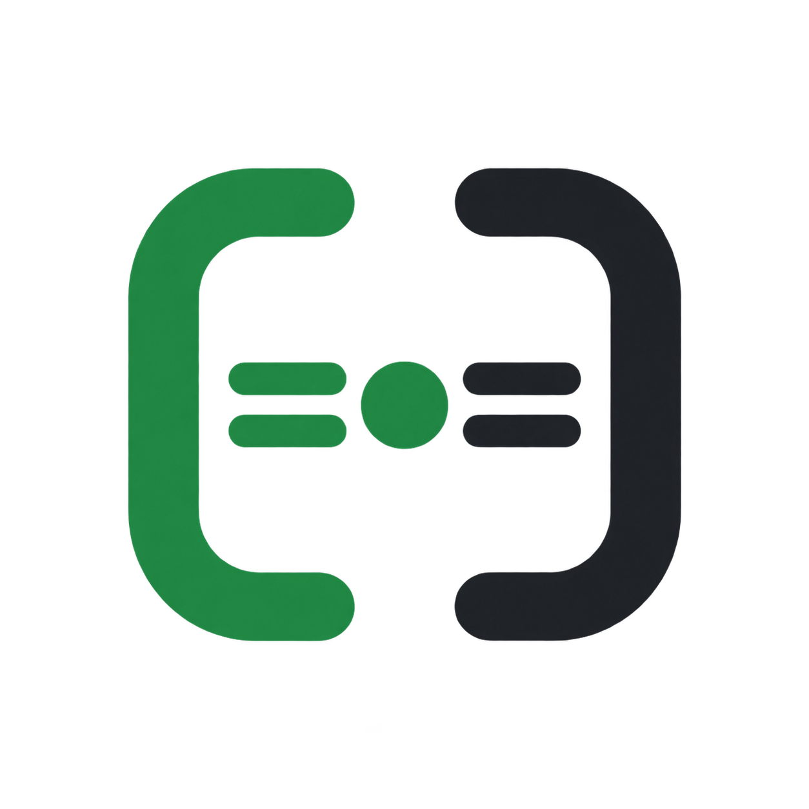
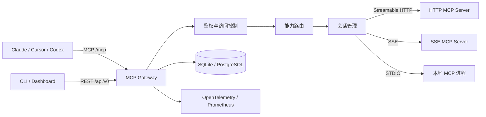
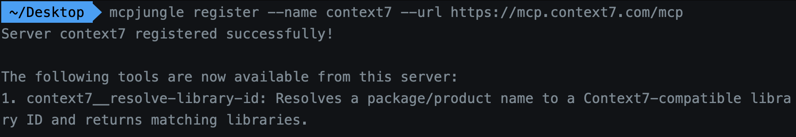
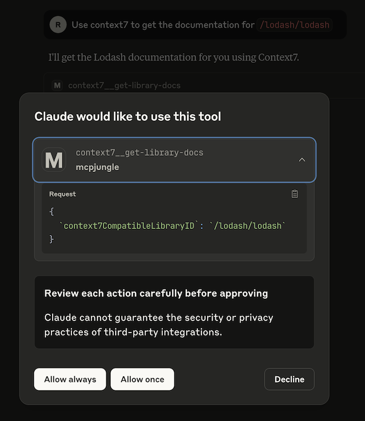
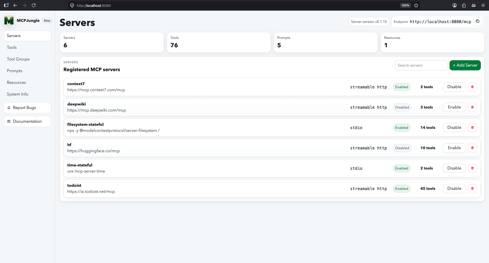

<p align="center">
  
</p>

<h1 align="center">MCP Gateway</h1>

<p align="center">
  面向 Claude、Cursor、Codex 等 AI 客户端的统一 MCP 接入网关
</p>

MCP Gateway 是一个使用 Go 开发的自托管 MCP 网关。它可以集中注册和管理多个上游 MCP Server，并将分散的 Tools、Prompts 与 Resources 聚合到统一端点，减少不同 AI 客户端之间的重复配置。

客户端只需要连接 MCP Gateway，网关负责上游能力发现、请求路由、连接管理、访问控制和调用指标采集。

## 核心能力

- **统一 MCP 入口**：通过 `/mcp` 向 AI 客户端提供统一的 Streamable HTTP 接入端点。
- **多种上游传输方式**：支持 Streamable HTTP、SSE 和 STDIO MCP Server。
- **动态服务管理**：支持 MCP Server 注册、查询、启用、停用和注销，并同步维护 Tools、Prompts 与 Resources。
- **能力聚合与命名隔离**：使用 `server__tool` 等规范名解决不同上游之间的工具重名问题。
- **会话管理**：支持 Stateless 和 Stateful 两种模式，包括连接复用、空闲回收与异常连接失效重建。
- **访问控制**：Enterprise 模式下支持管理用户鉴权、MCP Client Token 和 Server 级访问范围控制。
- **Tool Group**：可以将完整工具集合裁剪为不同分组，只向指定场景暴露需要的工具。
- **可观测性**：基于 OpenTelemetry 采集工具调用次数、调用结果和执行延迟，并提供 Prometheus `/metrics` 端点。
- **可视化管理**：内置 Dashboard，可查看和管理 Server、Tool、Prompt、Resource 与 Tool Group。

## 工作原理



一次工具调用的大致流程如下：

1. AI 客户端向 MCP Gateway 的 `/mcp` 端点发起调用。
2. 网关解析 `server__tool` 规范名，确定工具所属的上游 Server。
3. Enterprise 模式下检查 MCP Client 是否拥有该 Server 的访问权限。
4. 根据 Server 配置获取 Stateless 临时连接或复用 Stateful 长连接。
5. 去掉网关添加的 Server 前缀，将原始工具名和参数转发给上游。
6. 将上游 MCP 响应原样返回客户端，同时记录调用结果和耗时指标。

## 技术栈

| 分类 | 技术 |
| --- | --- |
| 后端语言 | Go |
| HTTP API | Gin |
| CLI | Cobra |
| MCP SDK | mcp-go |
| 数据访问 | GORM |
| 数据库 | SQLite、PostgreSQL |
| 可观测性 | OpenTelemetry、Prometheus |
| Dashboard | React、TypeScript、Vite |

## 快速开始

### 环境要求

- Go 1.24 或更高版本
- Node.js 与 npm
- Bash（Windows 可使用 Git Bash 或 WSL）

### 1. 克隆项目

```bash
git clone https://github.com/zcray0326/mcp-gateway.git
cd mcp-gateway
```

### 2. 构建 Dashboard

Dashboard 会被编译并嵌入 Go 二进制，因此首次启动前需要先构建前端：

```bash
bash scripts/build-dashboard.sh
```

也可以单独启动前端开发服务器：

```bash
cd web/dashboard
npm ci
npm run dev
```

前端开发地址默认为 `http://localhost:5173`。

### 3. 启动网关

```bash
go run . start --host 127.0.0.1
```

默认地址：

| 功能 | 地址 |
| --- | --- |
| Dashboard | `http://localhost:8080` |
| MCP 统一端点 | `http://localhost:8080/mcp` |
| 健康检查 | `http://localhost:8080/health` |
| REST API | `http://localhost:8080/api/v0` |
| Prometheus 指标 | `http://localhost:8080/metrics`（启用 OTEL 后） |

默认未配置 PostgreSQL 时，项目会在当前目录使用 SQLite 数据库 `mcp-gateway.db`。

## 注册第一个 MCP Server

保持网关运行，在另一个终端注册 Context7：

```bash
go run . register --name context7 --url https://mcp.context7.com/mcp
```

注册时网关会连接上游，执行 MCP 初始化和能力发现，并将获取到的 Tools、Prompts 与 Resources 写入数据库及内存代理。

<p align="center">
  
</p>

查看已注册的 Server 和工具：

```bash
go run . list servers
go run . list tools
```

也可以直接调用工具：

```bash
go run . invoke context7__resolve-library-id --input '{"libraryName":"lodash"}'
```

> 具体参数以 `go run . invoke --help` 和目标工具的 Input Schema 为准。

## 连接 AI 客户端

以支持 JSON MCP 配置的客户端为例，可以通过 `mcp-remote` 连接本地网关：

```json
{
  "mcpServers": {
    "mcp-gateway": {
      "command": "npx",
      "args": [
        "mcp-remote",
        "http://localhost:8080/mcp",
        "--allow-http"
      ]
    }
  }
}
```

配置完成后，Claude、Cursor 或其他 MCP Client 只连接这一个地址，即可发现网关聚合后的工具。

<p align="center">
  
</p>

## Dashboard

Dev 模式启动后访问 `http://localhost:8080`，可以在页面中查看 Server 数量、工具列表、传输方式及启停状态。

<p align="center">
  
</p>

Dashboard 当前支持：

- 注册、启用、停用和删除 MCP Server
- 查看和启停 Tools、Prompts
- 查看 Resources
- 创建和查看 Tool Groups
- 查看网关版本、统一端点和运行状态

## 上游 Server 配置

### Streamable HTTP

```bash
go run . register --name context7 --url https://mcp.context7.com/mcp
```

### SSE

SSE 同样通过 JSON 配置文件注册：

```json
{
  "name": "legacy-server",
  "transport": "sse",
  "url": "http://localhost:3000/sse",
  "session_mode": "stateless"
}
```

```bash
go run . register --conf legacy-server.json
```

### STDIO

STDIO Server 使用配置文件注册，示例：

```json
{
  "name": "filesystem",
  "transport": "stdio",
  "command": "npx",
  "args": [
    "-y",
    "@modelcontextprotocol/server-filesystem",
    "."
  ],
  "session_mode": "stateful"
}
```

```bash
go run . register --conf filesystem.json
```

## Stateful 与 Stateless

- **Stateless**：每次调用创建新的上游连接，调用结束后立即关闭。请求之间相互隔离，是默认模式。
- **Stateful**：同一上游复用持久连接，适合初始化成本高或依赖会话状态的 MCP Server。

Stateful 会话由 `SessionManager` 管理：

- 首次调用时建立连接
- 后续请求复用同一连接
- 调用出现连接错误时使旧连接失效
- 下一次调用自动重建连接
- 根据空闲超时定期回收
- 网关退出时统一关闭

## 运行模式

### Development

默认模式，适合个人在本机使用：

- 首次启动自动初始化
- Dashboard 可用
- REST API 和 MCP 端点默认不要求 Token

建议通过 `--host 127.0.0.1` 仅监听本机，避免把无鉴权服务暴露到局域网。

### Enterprise

```bash
go run . start --enterprise
```

Enterprise 模式提供：

- 管理用户 Access Token
- MCP Client Token
- MCP Client 对上游 Server 的访问范围控制
- Prometheus 指标默认启用

Enterprise 模式首次启动后，需要使用 `init-server` 命令完成初始化并取得管理员 Token。

## 常用环境变量

| 变量 | 作用 | 默认值 |
| --- | --- | --- |
| `PORT` | HTTP 服务端口 | `8080` |
| `MCP_GATEWAY_BIND_HOST` | HTTP 服务监听地址 | 所有网卡 |
| `DATABASE_URL` | PostgreSQL DSN；为空时使用 SQLite | 空 |
| `SQLITE_DB_PATH` | 自定义 SQLite 文件路径 | `./mcp-gateway.db` |
| `SERVER_MODE` | `development` 或 `enterprise` | `development` |
| `OTEL_ENABLED` | 是否启用指标采集 | Dev 关闭、Enterprise 开启 |
| `MCP_SERVER_INIT_REQ_TIMEOUT_SEC` | 上游 MCP 初始化超时 | `30` |
| `SESSION_IDLE_TIMEOUT_SEC` | Stateful 会话空闲回收时间 | 使用服务默认值 |

## 项目结构

```text
.
├── cmd/                        # Cobra 命令和启动依赖装配
├── client/                     # REST API 客户端，供 CLI 调用网关
├── internal/api/               # Gin 路由、Handler 和鉴权中间件
├── internal/service/mcp/       # MCP 注册、代理、工具和会话核心逻辑
├── internal/service/toolgroup/ # Tool Group 管理
├── internal/model/             # GORM 持久化模型
├── internal/db/                # SQLite/PostgreSQL 连接
├── internal/telemetry/         # OpenTelemetry 与 Prometheus 指标
├── web/dashboard/              # React Dashboard
├── docs/                       # 使用说明和功能截图
└── main.go                     # 程序入口
```

## 开发与验证

```bash
# 格式化
go fmt ./...

# 运行测试
go test ./...

# 只检查所有 Go 包能否编译
go test ./... -run '^$'

# 构建二进制
go build -o mcp-gateway .
```

更多设计与源码阅读说明见 [项目学习指南](./mydoc/PROJECT_STUDY_GUIDE.zh-CN.md)。
